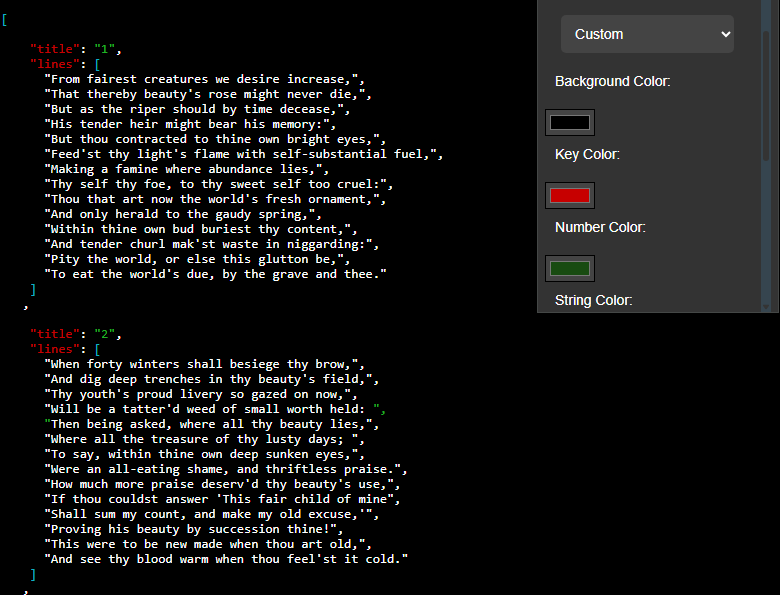
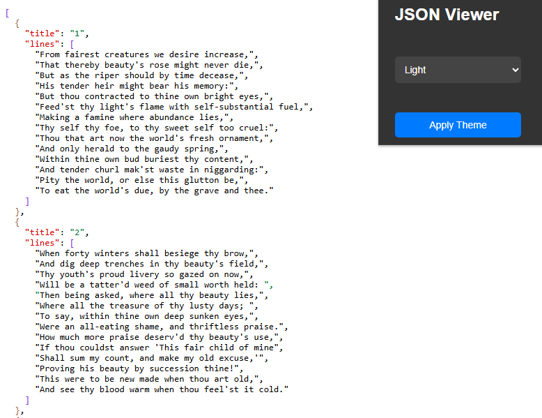
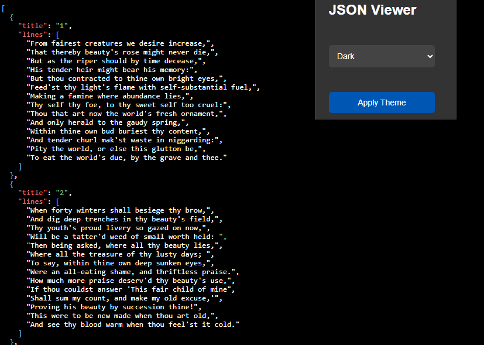

# JSON Color Template Chrome Extension

This Chrome extension allows you to view JSON data in a more readable and colorful way. It is ideal for developers and anyone working with data to quickly inspect and analyze JSON files.

## Features
- Automatically detects and highlights JSON data.
- User-friendly and simple interface.
- Quick access via popup.

## Installation
1. Download or clone this project.
2. Go to `chrome://extensions/` in your Chrome browser.
3. Enable "Developer mode" in the top right corner.
4. Click "Load unpacked" and select the project folder.

## Usage
When you open a JSON file or a web page containing JSON, the extension will automatically activate and highlight the data. You can also click the extension icon to access the popup interface.

## Screenshots
Below are some example screenshots of the extension:

*Custom theme.*

*light theme.*

*Dark theme.*

## Contributing
Contributions are welcome! Please feel free to submit a pull request.

## License
MIT
